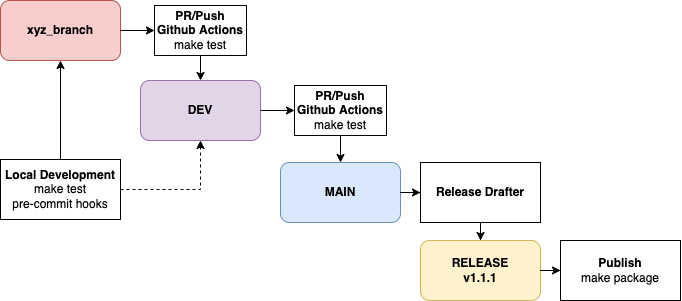

# Contributing Quickstart (on a Mac)

1) `brew install poetry` OR `make poetry-download`
2) `make pre-commit-install`
3) Make a new branch, from `dev`
4) Code, test, PR, merge into `dev`

## Pycharm Setup

1) download the `poetry` plugin
2) add `poetry` as the python interpreter

# How to contribute

## Development & CICD Overview



## Dependencies

We use `poetry` to manage the [dependencies](https://github.com/python-poetry/poetry). If you dont have `poetry`, you
should install with `make poetry-download`.

To install dependencies and prepare [`pre-commit`](https://pre-commit.com/) hooks you would need to run `install` command:

```bash
make install
make pre-commit-install
```

To activate your `virtualenv` run `poetry shell`.

## Codestyle

After installation you may execute code formatting.

```bash
make codestyle
```

### Checks

Many checks are configured for this project. Command `make check-codestyle` will check black, isort and darglint.
The `make check-safety` command will look at the security of your code.

Comand `make lint` applies all checks.

### Before submitting

Before submitting your code please do the following steps:

1. Add any changes you want
1. Add tests for the new changes
1. Edit documentation if you have changed something significant
1. Run `make codestyle` to format your changes.
1. Run `make lint` to ensure that types, security and docstrings are okay.

---
## First Steps 

### Poetry

Want to know more about Poetry? Check [its documentation](https://python-poetry.org/docs/).

<details>
<summary>Details about Poetry</summary>
<p>

Poetry's [commands](https://python-poetry.org/docs/cli/#commands) are very intuitive and easy to learn, like:

- `poetry add numpy@latest`
- `poetry run pytest`

etc
</p>
</details>

### Building and releasing your package

Building a new version of the application contains steps:

- Bump the version of your package `poetry version <version>`. You can pass the new version explicitly, or a rule such as `major`, `minor`, or `patch`. For more details, refer to the [Semantic Versions](https://semver.org/) standard.
- Make a commit to `GitHub`.
- Create a `GitHub release`.

## 🚀 Features

### Development features

- Supports for `Python 3.8` and higher.
- [`Poetry`](https://python-poetry.org/) as the dependencies manager. See configuration in [`pyproject.toml`](https://github.com/telescope/telescope/blob/main/pyproject.toml) and [`setup.cfg`](https://github.com/telescope/telescope/blob/master/setup.cfg).
- Automatic codestyle with [`black`](https://github.com/psf/black), [`isort`](https://github.com/timothycrosley/isort) and [`pyupgrade`](https://github.com/asottile/pyupgrade).
- Ready-to-use [`pre-commit`](https://pre-commit.com/) hooks with code-formatting.
- Type checks with [`mypy`](https://mypy.readthedocs.io); docstring checks with [`darglint`](https://github.com/terrencepreilly/darglint); security checks with [`safety`](https://github.com/pyupio/safety) and [`bandit`](https://github.com/PyCQA/bandit)
- Testing with [`pytest`](https://docs.pytest.org/en/latest/).
- Ready-to-use [`.editorconfig`](https://github.com/telescope/telescope/blob/main/.editorconfig), [`.dockerignore`](https://github.com/telescope/telescope/blob/main/.dockerignore), and [`.gitignore`](https://github.com/telescope/telescope/blob/master/.gitignore). You don't have to worry about those things.

### Deployment features

- `GitHub` integration: issue and pr templates.
- `Github Actions` with predefined [build workflow](https://github.com/telescope/telescope/blob/main/.github/workflows/build.yml) as the default CI/CD.
- Everything is already set up for security checks, codestyle checks, code formatting, testing, linting, docker builds, etc with [`Makefile`](https://github.com/telescope/telescope/blob/main/Makefile#L89). More details in [makefile-usage](#makefile-usage).
- [Dockerfile](https://github.com/telescope/telescope/blob/main/docker/Dockerfile) for your package.
- Always up-to-date dependencies with [`@dependabot`](https://dependabot.com/). You will only [enable it](https://docs.github.com/en/github/administering-a-repository/enabling-and-disabling-version-updates#enabling-github-dependabot-version-updates).
- Automatic drafts of new releases with [`Release Drafter`](https://github.com/marketplace/actions/release-drafter). You may see the list of labels in [`release-drafter.yml`](https://github.com/telescope/telescope/blob/main/.github/release-drafter.yml). Works perfectly with [Semantic Versions](https://semver.org/) specification.

### Open source community features

- [Semantic Versions](https://semver.org/) specification with [`Release Drafter`](https://github.com/marketplace/actions/release-drafter).

## Installation

```bash
pip install -U telescope
```

or install with `Poetry`

```bash
poetry add telescope
```

Then you can run

```bash
telescope --help
```

or with `Poetry`:

```bash
poetry run telescope --help
```

### Makefile usage

[`Makefile`](https://github.com/telescope/telescope/blob/main/Makefile) contains a lot of functions for faster development.

<details>
<summary>1. Download and remove Poetry</summary>
<p>

To download and install Poetry run:

```bash
make poetry-download
```

To uninstall

```bash
make poetry-remove
```

</p>
</details>

<details>
<summary>2. Install all dependencies and pre-commit hooks</summary>
<p>

Install requirements:

```bash
make install
```

Pre-commit hooks coulb be installed after `git init` via

```bash
make pre-commit-install
```

</p>
</details>

<details>
<summary>3. Codestyle</summary>
<p>

Automatic formatting uses `pyupgrade`, `isort` and `black`.

```bash
make codestyle

# or use synonym
make formatting
```

Codestyle checks only, without rewriting files:

```bash
make check-codestyle
```

> Note: `check-codestyle` uses `isort`, `black` and `darglint` library

<details>
<summary>4. Code security</summary>
<p>

```bash
make check-safety
```

This command launches `Poetry` integrity checks as well as identifies security issues with `Safety` and `Bandit`.

```bash
make check-safety
```

</p>
</details>

<details>
<summary>5. Type checks</summary>
<p>

Run `mypy` static type checker

```bash
make mypy
```

</p>
</details>

<details>
<summary>6. Tests</summary>
<p>

Run `pytest`

```bash
make test
```

</p>
</details>

<details>
<summary>7. All linters</summary>
<p>

Of course there is a command to ~~rule~~ run all linters in one:

```bash
make lint
```

the same as:

```bash
make test && make check-codestyle && make mypy && make check-safety
```

</p>
</details>

<details>
<summary>8. Docker</summary>
<p>

```bash
make docker-build
```

which is equivalent to:

```bash
make docker-build VERSION=latest
```

Remove docker image with

```bash
make docker-remove
```

More information [about docker](https://github.com/telescope/telescope/tree/master/docker).

</p>
</details>

<details>
<summary>9. Cleanup</summary>
<p>
Delete pycache files

```bash
make pycache-remove
```

Remove package build

```bash
make build-remove
```

Or to remove pycache, build and docker image run:

```bash
make clean-all
```

</p>
</details>

## 📈 Releases

You can see the list of available releases on the [GitHub Releases](https://github.com/telescope/telescope/releases) page.

We follow [Semantic Versions](https://semver.org/) specification.

We use [`Release Drafter`](https://github.com/marketplace/actions/release-drafter). As pull requests are merged, a draft release is kept up-to-date listing the changes, ready to publish when you’re ready. With the categories option, you can categorize pull requests in release notes using labels.

### List of labels and corresponding titles

|               **Label**               |  **Title in Releases**  |
| :-----------------------------------: | :---------------------: |
|       `enhancement`, `feature`        |       🚀 Features       |
| `bug`, `refactoring`, `bugfix`, `fix` | 🔧 Fixes & Refactoring  |
|       `build`, `ci`, `testing`        | 📦 Build System & CI/CD |
|              `breaking`               |   💥 Breaking Changes   |
|            `documentation`            |    📝 Documentation     |
|            `dependencies`             | ⬆️ Dependencies updates |

You can update it in [`release-drafter.yml`](https://github.com/telescope/telescope/blob/main/.github/release-drafter.yml).

GitHub creates the `bug`, `enhancement`, and `documentation` labels for you. Dependabot creates the `dependencies` label. Create the remaining labels on the Issues tab of your GitHub repository, when you need them.

## Credits [](https://github.com/TezRomacH/python-package-template)

This project was generated with [`python-package-template`](https://github.com/TezRomacH/python-package-template)
